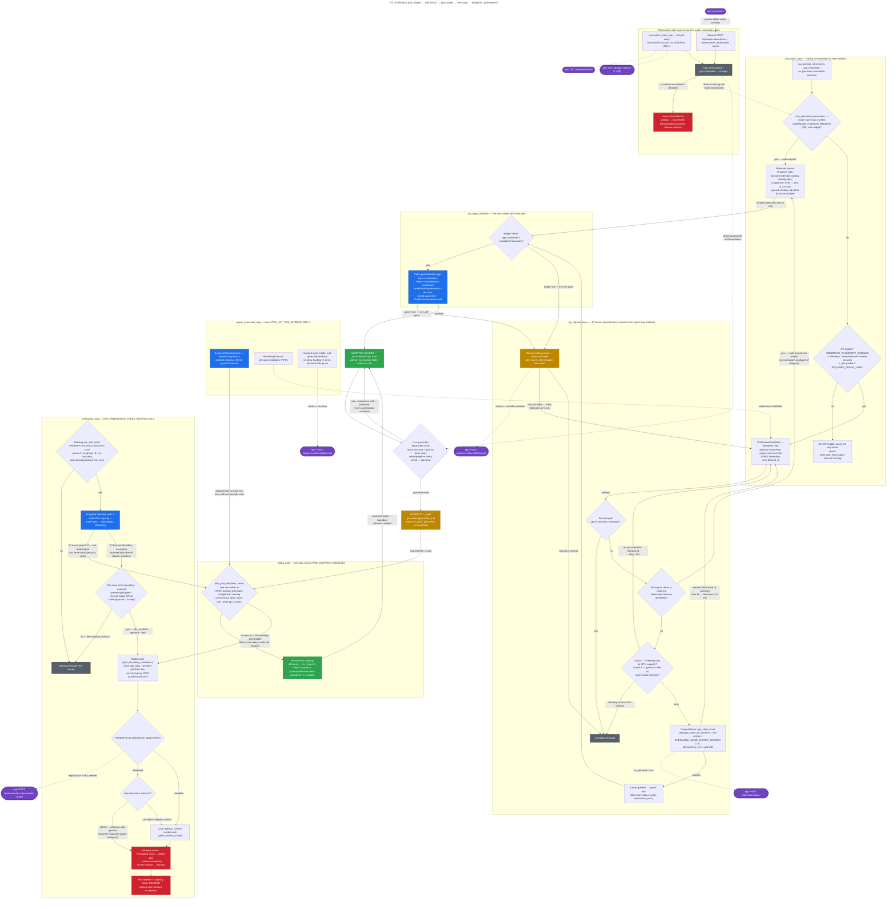

# On-demand (JIT) jobs — lease, overstay, and preemption

How the controller handles **just-in-time (JIT) on-demand jobs** — pods with no
reservation open now or soon, for which the controller books a short on-demand
reservation on the pod's behalf — and what happens once such a job **overstays**
its runtime guarantee and becomes subject to **demand-driven preemption**.

The diagram shows every call-out to the GPU Reservation App (the app's interior
is not modelled) and the other parts of the controller that directly affect
on-demand jobs: routing in `pod_watch_loop`, the shared admission path, the
queue-processor tick, the preemption sweep with its adoption rescue pass, and
the reservation-state sync (fetch loop + inbound push).

Code anchors: `app/main.py` (`_try_request_lease`, `_try_apply_toleration`,
`_run_preemption_sweep`, `_adopt_pods`), `app/controller.py`
(`find_admittable_reservation`, `guarantee_end`, `plan_pod_adoptions`,
`plan_boundary_candidates`), `app/reservation_client.py` (all HTTP call-outs).

## Why a flowchart

Three Mermaid types were considered. A **state diagram** models a single pod's
lifecycle well but hides *who* acts (four concurrent loops) and reduces the app
call-outs to transition-label footnotes. A **sequence diagram** is the natural
shape for call-outs, but this logic is dominated by branching — routing checks,
guards, grant/deny, delegate/fallback — and by hour-scale gaps between admission
and overstay, which nested `alt` frames and a single time axis handle poorly. A
**flowchart with subgraphs** shows all three things at once: the decision logic,
which background loop owns each step, and every app call-out as a labelled
dashed edge to a purple endpoint node. Flowchart it is.

## The diagram

### Legend

| Convention | Meaning |
|---|---|
| Solid arrow | Control flow inside the controller |
| Dashed arrow | HTTP call-out to / from the app, or a state feed |
| Purple stadium node (`app: …`) | GPU Reservation App endpoint — external, interior not modelled |
| Blue node | Step whose work is Kubernetes API calls (patch / snapshot / events / delete) |
| Green node | Pod in a protected state (admitted holder, freshly adopted) |
| Amber node | Overstay state and compensating actions |
| Red node | Pod-terminating outcome |
| Grey node | Terminal / shared-state box |

## App call-outs at a glance

| Endpoint | Direction | Called from | Role for on-demand jobs | On failure |
|---|---|---|---|---|
| `GET /api/reservations` | controller → app | fetch loop (every 300 s) | Active set that drives routing, guarantees, and boundaries | Refresh cycle aborts; previous state kept |
| `GET /api/gpu-classes` (+ `/{id}` fallback) | controller → app | fetch / push reconcile | `label ↔ id` maps — a lease request needs the numeric `gpu_class_id` | Previous cycle's maps kept |
| `POST /api/reservations` | controller → app | `_try_request_lease` | Create the JIT lease (`on_demand=true`, sized min-runtime + buffer, idempotent by pod UID) | Treated as a denial → 2–5 min cool-down, retry |
| `POST /api/reservations/{id}/cancel` | controller → app | lease-grant cleanup; no-show cancels on the tick | `reason=controller-revoked` when admission fails after a grant; `reason=no-show` when a vacated lease times out | Logged; a dangling lease is later reaped by no-show tracking |
| `POST /api/reservations/preemption-victims` | controller → app | preemption sweep | App chooses victims **among** the controller's eligible pool | Local uniform-random fallback (`select_victims_locally`) |
| `POST /api/reservations/push` | app → controller | inbound API (bearer token) | Pushes reservation deltas within seconds — a pushed lease cancellation evicts its holder | Next full pull remains the source of truth |

## Reading notes

- **An on-demand job is an ordinary reservation holder.** Once admitted under
  `res-<id>` it is charged SU, protected by the same runtime guarantee, and
  displaces overstayers via the same boundary preemption as any booking — there
  is no separate on-demand admission or preemption code path.
- **A pod within its guarantee is never a preemption candidate**, however
  severe the shortfall. Only past-guarantee pods are ever offered to the app.
- **The guarantee is recomputed live and can grow.** `guarantee_end` returns
  lease `slot_end` plus any back-to-back chain (same user, class, `gpu_count`,
  abutting windows). An abutting re-book therefore extends the guarantee with
  no controller action; **adoption** covers what chaining cannot reach — a gap,
  a window starting "now", or a different `gpu_count`.
- **Adoption runs before victim planning** inside the sweep (and lazily every
  tick), so a pod whose user just re-booked is re-homed, credits the boundary's
  demand, and can never be selected as a victim in the same sweep.
- **Victim authority is split**: the controller alone decides *eligibility*
  (past-guarantee pods it admitted); the app decides *which* of those die. An
  unknown UID in the app's response is ignored, an empty list ("spare
  everyone") is respected, and any call failure falls back to local
  uniform-random selection so preemption still works.
- **Phase A (lead-time) may preempt on behalf of a reservation that later
  no-shows** — an accepted trade-off, not a bug. Phase B (at-boundary)
  additionally catches pods whose own guarantee ends exactly at the boundary.
  Each boundary/phase pair fires at most once (`preemption_fired`).
- **The sweep never acts on unknown physical state**: if either the pod
  snapshot or the node-capacity snapshot fails, the whole sweep is skipped
  with a warning and nothing is killed.
- **Failure containment on the lease path**: a grant whose admission fails
  (budget race, patch error, pod went terminal) is compensating-cancelled
  (`reason=controller-revoked`) so it is never left dangling; the request
  itself is idempotent by pod UID, so a retry after a lost response returns
  the original lease instead of double-booking.
- **Serialisation**: the lease grant + admission, the adoption pass, and sweep
  planning/kills all run under `ControllerState.reservation_lock`, so a
  concurrent fetch or push cannot swap the reservation set mid-decision.
